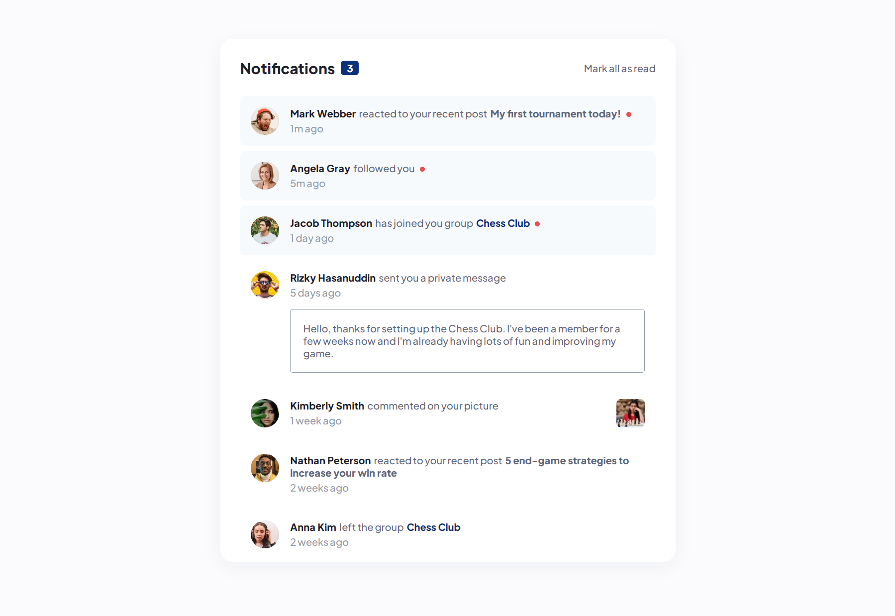

# Frontend Mentor - Notifications page solution

This is a solution to the [Notifications page challenge on Frontend Mentor](https://www.frontendmentor.io/challenges/notifications-page-DqK5QAmKbC). Frontend Mentor challenges help you improve your coding skills by building realistic projects. 

## Table of contents

- [The challenge](#the-challenge)
- [Screenshot](#screenshot)
- [Links](#links)
- [Extra](#extra)  
- [Author](#author)

## The challenge

Users should be able to:

- Distinguish between "unread" and "read" notifications
- Select "Mark all as read" to toggle the visual state of the unread notifications and set the number of unread messages to zero
- View the optimal layout for the interface depending on their device's screen size
- See hover and focus states for all interactive elements on the page

## Screenshot

## Links

- Solution URL: [GitHub Repository](https://github.com/joangute/notifications-page/)
- Live Site URL: [GitHub Pages](https://joangute.github.io/notifications-page/)

## Extra

This was my first junior solution for Frontend Mentor, so I wanted to add an extra, This component clear all unread notifications and show us "0" in the counter, I added that you can clear one by one clicking in individual unread notification and showing us in the counter "2","1" and "0".

## Author

- Frontend Mentor - [@joangute](https://www.frontendmentor.io/profile/joangute)